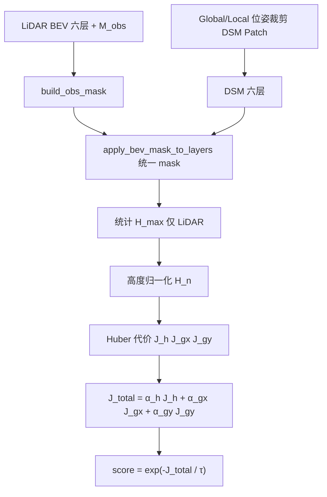
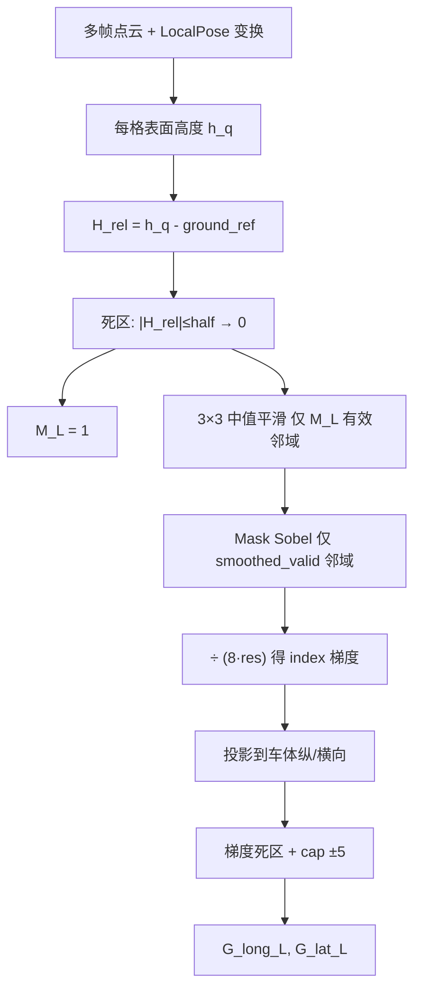
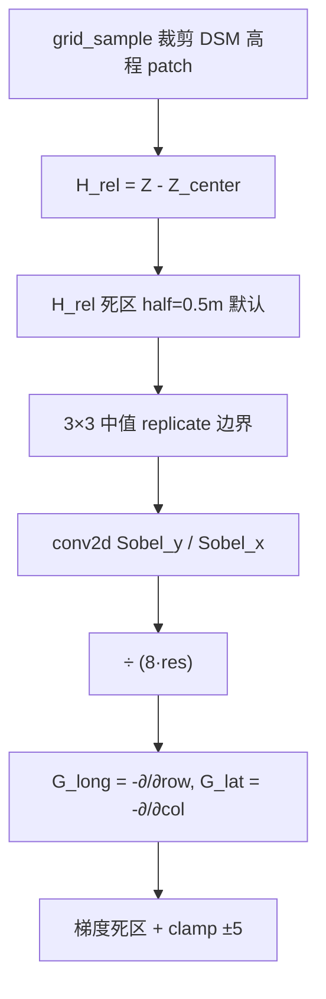

# DSM-BEV Score 与梯度生成说明

本文档描述当前代码实现中的 **DSM-BEV 匹配分数** 计算公式、参数，以及 **LiDAR BEV / DSM Patch** 两侧 **G_long_L / G_lat_L** 的生成流程。

对应源码：

| 模块 | 文件 |
|------|------|
| Score 计算 | `program/dem_loc/loc_tool/dsm_bev_score.py` |
| Score 调度 | `program/dem_loc/loc_tool/dsm_bev_score_runner.py` |
| ROS 入口 | `program/dem_loc/scripts/localization_python.py` |
| LiDAR BEV 生成 | `program/GridMap_v7_5_ros1/src/lidar_bev_builder.cpp` |
| DSM Patch 生成 | `program/dem_loc/loc_tool/dsm_patch.py` |
| LiDAR BEV 参数 | `program/GridMap_v7_5_ros1/config/GridMapInit.ini` |

---

## 1. 图层命名对照

| 设计文档 / Score | LiDAR BEV (GridMap) | DSM Patch |
|------------------|---------------------|-----------|
| `H_L` / `H_D` | `H_rel_surf` | `H_rel_surf` |
| `Gx_L` / `Gx_D`（横向） | `G_lat_L` | `G_lat_L` |
| `Gy_L` / `Gy_D`（纵向） | `G_long_L` | `G_long_L` |
| `M_obs` | `M_L` | （打分用 LiDAR 的 `M_L`） |

单位：高度 m；梯度 m/m（高度随水平距离变化率）。

---

## 2. DSM-BEV Score 计算

### 2.1 总体流程



对 **GlobalPose** 与 **LocalPose** 各裁剪一次 DSM patch，共用同一帧 LiDAR BEV 与同一 `H_max`。

### 2.2 观测 Mask

**高度项**使用 `M_obs`：

\[
M_{\text{obs}}(i) = \mathbb{1}[M_L(i) > 0.5 \;\land\; \text{finite}]
\]

**梯度项**使用腐蚀后的 `M_grad`：

\[
M_{\text{grad}} = \text{erode}(M_{\text{obs}},\, n_{\text{erode}}) \;\land\; \text{finite}(G_{x,L}, G_{y,L}, G_{x,D}, G_{y,D})
\]

打分时梯度先 **截断**：\(|G| \leftarrow \mathrm{clip}(G,\,-g_{\cap},\, g_{\cap})\)。

### 2.3 高度归一化

在 `M_obs` 内统计 **仅 LiDAR** 的非地面高度：

\[
\mathcal{V}_h = \{ i \mid M_{\text{obs}}(i) \;\land\; H_L(i) > h_{\text{ground}} \}
\]

若 \(|\mathcal{V}_h| \ge N_{\min}\)：

\[
H_{\max} = \mathrm{clip}\big(\mathrm{percentile}_{p}(H_L[\mathcal{V}_h]),\; h_{\min},\; h_{\max}\big)
\]

否则 \(H_{\max} = h_{\min}\)。

归一化（负值截为 0）：

\[
H_n(i) = \frac{\mathrm{clip}(H(i),\, 0,\, H_{\max})}{H_{\max}}
\]

分别得到 \(H_{L,n}\)、\(H_{D,n}\)。

### 2.4 Huber 函数

\[
\mathrm{Huber}(e,\,\delta) =
\begin{cases}
\frac{1}{2} e^2 & |e| \le \delta \\
\delta\left(|e| - \frac{\delta}{2}\right) & |e| > \delta
\end{cases}
\]

### 2.5 高度代价 \(J_h\)

误差：

\[
e_h = H_{L,n} - H_{D,n}
\]

非对称权重：

\[
\lambda_h(i) =
\begin{cases}
\lambda_{\text{lidar↑}} & H_{L,n}(i) > H_{D,n}(i) \\
\lambda_{\text{dsm↑}} & \text{otherwise}
\end{cases}
\]

\[
P_h(i) = \lambda_h(i) \cdot \mathrm{Huber}(e_h(i),\, \delta_h)
\]

\[
J_h = \frac{1}{|\mathcal{M}| + \varepsilon} \sum_{i \in M_{\text{obs}}} P_h(i)
\]

（仅对 mask 内有限值求平均。）

### 2.6 梯度代价 \(J_{gx}\)、\(J_{gy}\)

误差：

\[
e_{gx} = G_{x,L} - G_{x,D}, \quad e_{gy} = G_{y,L} - G_{y,D}
\]

（打分时已 `grad_cap` 截断。）

权重（随 LiDAR 梯度幅度增大）：

\[
w_{gx}(i) = w_0 + (1 - w_0)\,|G_{x,L}(i)|, \quad
w_{gy}(i) = w_0 + (1 - w_0)\,|G_{y,L}(i)|
\]

\[
P_{gx}(i) = w_{gx}(i) \cdot \mathrm{Huber}(e_{gx}(i),\, \delta_g)
\]

\[
J_{gx} = \frac{\sum_{i \in M_{\text{grad}}} P_{gx}(i)}{\sum_{i \in M_{\text{grad}}} w_{gx}(i) + \varepsilon}
\]

\(J_{gy}\) 同理。

### 2.7 总代价与 Score

\[
J_{\text{total}} = \alpha_h J_h + \alpha_{gx} J_{gx} + \alpha_{gy} J_{gy}
\]

\[
\mathrm{score} = \exp\left(-\frac{J_{\text{total}}}{\tau}\right)
\]

score 越大表示 LiDAR BEV 与 DSM patch 越一致。\(J_{\text{total}}=0 \Rightarrow \mathrm{score}=1\)。

---

## 3. Score 参数表

### 3.1 `DsmBevScoreConfig` 默认值

定义于 `dsm_bev_score.py` 中 `@dataclass class DsmBevScoreConfig`。

| 参数 | 默认值 | 含义 |
|------|--------|------|
| `alpha_h` | 1 | 高度代价权重 |
| `alpha_gx` | 0 | 横向梯度代价权重 |
| `alpha_gy` | 0 | 纵向梯度代价权重 |
| `ground_threshold` | 0.20 m | 统计 \(H_{\max}\) 时低于此值视为地面 |
| `hmax_min` | 5.0 m | \(H_{\max}\) 下限 |
| `hmax_max` | 40.0 m | \(H_{\max}\) 上限 |
| `height_percentile` | 98.0 | \(H_{\max}\) 分位数 |
| `min_valid_height_points` | 10 | 有效高度样本不足时用 `hmax_min` |
| `lambda_lidar_higher` | 2.0 | LiDAR 高于 DSM 时的 Huber 倍率 |
| `lambda_dsm_higher` | 0.3 | DSM 高于 LiDAR 时的 Huber 倍率 |
| `delta_h` | 0.20 | 高度 Huber 阈值（归一化高度） |
| `delta_g` | 0.30 m/m | 梯度 Huber 阈值 |
| `w_g_base` | 0.2 | 梯度加权基值 |
| `tau` | 0.20 | score 温度，越小 score 对误差越敏感 |
| `eps` | 1e-6 | 均值分母稳定项 |
| `grad_cap` | 5.0 m/m | 打分前梯度截断 |
| `grad_mask_erode_px` | 2 | 梯度 mask 3×3 腐蚀迭代次数 |

### 3.2 ROS 可覆盖参数

`localization_python.py` 启动时仅覆盖以下私有参数（其余用 dataclass 默认）：

| ROS 参数 | 默认 | 对应字段 |
|----------|------|----------|
| `~alpha_h` | 0.5 | `alpha_h` |
| `~alpha_gx` | 0.25 | `alpha_gx` |
| `~alpha_gy` | 0.25 | `alpha_gy` |
| `~tau` | 0.20 | `tau` |

示例：

```bash
rosrun loc_bev localization_python.py _alpha_h:=1.0 _alpha_gx:=0 _alpha_gy:=0 _tau:=0.2
```

修改 `lambda_lidar_higher`、`grad_cap` 等：直接改 `dsm_bev_score.py` 中 `DsmBevScoreConfig`，或在 `localization_python.py` 构造时传入。

---

## 4. LiDAR BEV 梯度生成（GridMap）

实现：`LidarBevBuilder::build()` → `fillMapFromFrameHistory()` → `computeDirectionalGradients()`。

### 4.1 总体流程



### 4.2 相对高度 \(H\_rel\_surf\)

每格取点云上分位表面高度 \(h_q\)（top 15% 均值），减去地面参考 \(z_{\text{ref}}\)：

\[
H_{\text{rel,raw}} = h_q - z_{\text{ref}}
\]

死区（可选）：

\[
H_{\text{rel}} =
\begin{cases}
0 & |H_{\text{rel,raw}}| \le \text{half}_h \\
H_{\text{rel,raw}} & \text{otherwise}
\end{cases}
\]

有有效点的栅格：`M_L = 1`。

### 4.3 3×3 中值平滑

对每个 `M_L=1` 且 \(H_{\text{rel}}\) 有限的格，取 3×3 邻域内 **同样 mask 有效** 的 \(H_{\text{rel}}\) 做中值，得到 \(\tilde{H}\)。

条件：有效邻居数 \(\ge\) `edge_min_valid_neighbors`（ini 默认 5）。

### 4.4 Sobel 与 Mask

Sobel 核（与 OpenCV 一致）：

\[
K_x = \begin{bmatrix}-1&0&1\\-2&0&2\\-1&0&1\end{bmatrix}, \quad
K_y = \begin{bmatrix}-1&-2&-1\\0&0&0\\1&2&1\end{bmatrix}
\]

对 \(\tilde{H}\)：**仅 `smoothed_valid` 的邻域** 参与卷积；无效邻域 **不参与、不用中心值填充**。

\[
g_0 = \frac{\sum K_y \cdot \tilde{H}}{8 \cdot r}, \quad
g_1 = \frac{\sum K_x \cdot \tilde{H}}{8 \cdot r}
\]

其中 \(r\) = `lidar_bev_resolution`（默认 0.2 m）。

要求：有效 stencil 邻居数 \(\ge\) `edge_min_valid_neighbors` **且** \(\ge 9\)（3×3 全有效）。

### 4.5 投影到车体方向

将 index 方向梯度合成地图平面梯度，再投影到车体纵向 / 横向单位向量：

\[
\mathbf{g}_{\text{map}} = g_0 \,\hat{\mathbf{u}}_{\text{row}} + g_1 \,\hat{\mathbf{u}}_{\text{col}}
\]

\[
G_{\text{long},L} = \mathbf{g}_{\text{map}} \cdot \hat{\mathbf{u}}_{\text{long}}, \quad
G_{\text{lat},L} = \mathbf{g}_{\text{map}} \cdot \hat{\mathbf{u}}_{\text{lat}}
\]

### 4.6 梯度后处理

1. **梯度死区**：\(|G| \le \text{half}_g \Rightarrow G=0\)
2. **截断**：\(G \leftarrow \mathrm{clip}(G,\,-5,\,5)\) m/m（代码硬编码 `kGradCap=5`）

### 4.7 GridMap ini 相关参数

| ini 键 | 默认 | 含义 |
|--------|------|------|
| `lidar_bev_resolution` | 0.2 | 栅格分辨率 \(r\) (m) |
| `lidar_bev_h_rel_deadzone_half` | 0 | \(H_{\text{rel}}\) 死区半宽 (m) |
| `lidar_bev_grad_deadzone_half` | 2 | 梯度死区半宽 (m/m) |
| `lidar_bev_edge_min_valid_neighbors` | 5 | 中值/Sobel 最少有效邻居 |

---

## 5. DSM Patch 梯度生成

实现：`DsmPatchCropper.crop_with_bev_layers()` → `_compute_bev_layers_torch()`。

### 5.1 流程



### 5.2 公式

中心高程：patch 几何中心 \(Z_c = Z[\frac{H}{2}, \frac{W}{2}]\)。

\[
H_{\text{rel}} = \mathrm{deadzone}(Z - Z_c,\; \text{half}_h)
\]

\[
\tilde{H} = \mathrm{median}_{3\times3}(H_{\text{rel}})
\]

\[
G_{\text{long},D} = -\frac{\mathrm{conv}(\tilde{H},\, K_y)}{8r}, \quad
G_{\text{lat},D} = -\frac{\mathrm{conv}(\tilde{H},\, K_x)}{8r}
\]

后处理：梯度死区（默认 half=0.15 m/m）+ `clamp(±5)`。

### 5.3 与 LiDAR BEV 的差异

| 项目 | LiDAR BEV | DSM Patch |
|------|-----------|-----------|
| 输入 | 多帧点云累计 | 单帧 DSM 高程 |
| \(H_{\text{rel}}\) 参考 | 地面 ROI 估计 \(z_{\text{ref}}\) | patch 中心高程 |
| 中值 mask | 仅 `M_L` 有效邻域 | 全图 + replicate 边界 |
| Sobel mask | 仅有效邻域，需 9 邻域全有效 | 全图 conv2d |
| 方向投影 | 车体纵/横向投影 | patch 行/列方向（负号） |
| 参数来源 | `GridMapInit.ini` | `DsmPatchCropper` 构造默认 |

打分前 DSM 梯度通过 `dsm_layers_to_score_inputs()` 映射为 \(G_{x,D}, G_{y,D}\) 与 LiDAR 对齐。

---

## 6. 调试

```bash
# 一次性打印 J 分项、层统计
python3 program/dem_loc/scripts/debug_dsm_bev_score.py

# 可视化：3x4 对比窗 + Global masked patch 窗
rosrun loc_bev localization_python.py
```

verbose 日志（score < 0.05 自动开启）：

```
score #200 | Global=0.0067 Local=0.0062 | G: J_h=... J_gx=... J_gy=... J=... n=... ng=...
```

- `n`：`M_obs` 有效像素数  
- `ng`：参与梯度打分的 `M_grad` 像素数  
